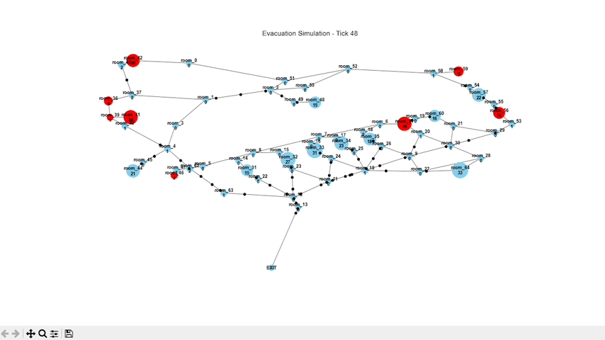
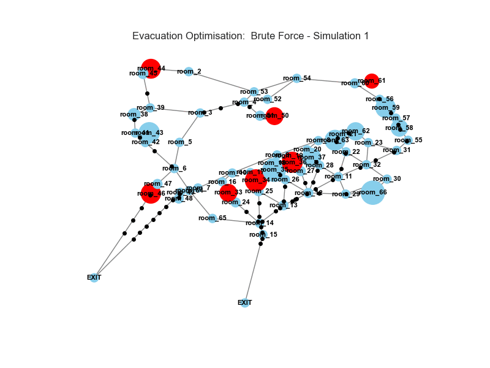

<div align="center">

# 🚨 Emergency Evacuation Optimizer

### *When Graph Theory Meets Genetic Algorithms*

[](https://www.python.org/)
[](https://networkx.org/)
[](https://geopandas.org/)
[](https://opensource.org/licenses/MIT)

**Agent-based evacuation simulation with genetic algorithm optimization for emergency exit placement**

[🎥 View Demo](#-demo) <!--- • [📖 Read Article](https://medium.com/@yourhandle) -->• [🚀 Quick Start](#-quick-start) • [📊 Results](#-results)

<figure align="center">
  
  <figcaption><em>Figure 1: Evacuation Simulation Demo</em></figcaption>
</figure>

<figure align="center">
  
  <figcaption><em>Figure 2: Brute-Force Optimisation Demo</em></figcaption>
</figure>
---

</div>

## 🎯 Overview

This project simulates building evacuations using **agent-based modeling** and optimizes emergency exit placement using **genetic algorithms** and **brute force search**.

### The Problem

> *Where should you place a new emergency exit to minimize evacuation time?*

Given a school with 200+ students and only one exit, this system:
1. 🗺️ Models the entire building as a spatial graph
2. 👥 Simulates individual agents navigating to exits
3. 🧬 Evolves optimal exit locations using genetic algorithms
4. 📊 Validates results with exhaustive brute force search

### Key Results

| Configuration | Evacuation Time (ticks) | Improvement |
|---------------|-------------------------|-------------|
| **Baseline (1 exit)** | 1741 | — |
| **Brute Force Optimised (2 exits)** | 1207 | **30.7% faster** ⚡ |
| **Genetic-Algorithm Optimised (2 exits)** | 1309 | **24.8% faster** ⚡ |

---

## ✨ Features

### 🏗️ Spatial Modeling
- ✅ Real-world coordinates from QGIS floor plans
- ✅ Accurate edge distances (meters)
- ✅ Capacity constraints (hallway width, room occupancy)
- ✅ Multiple node types (classrooms, paths, exits)

### 🤖 Agent-Based Simulation
- ✅ Dijkstra's shortest path algorithm
- ✅ Realistic movement speed (0.5 m/tick)
- ✅ Collision detection & bottleneck identification
- ✅ State machine: `WAITING → MOVING → EXITED`

### 🧬 Optimization Algorithms

#### Genetic Algorithm
- **Tournament selection** (balances exploration/exploitation)
- **Arc interpolation crossover** (preserves boundary constraints)
- **Adaptive Gaussian mutation** (30% of boundary length)
- **Elitism** (preserves best solution)

#### Brute Force Search
- Exhaustive grid search along boundary
- Guaranteed global optimum
- Validation baseline for GA

### 📊 Visualization
- Real-time NetworkX graph rendering
- Animated agent movement along edges
- Color-coded bottleneck detection
- Matplotlib integration

---

## 🚀 Quick Start

### Prerequisites

```bash
python >= 3.9
pip install -r requirements.txt
```

### Installation

```bash
# Clone the repository
git clone https://github.com/yourusername/evacuation-optimizer.git
cd evacuation-optimizer

# Install dependencies
pip install networkx matplotlib geopandas shapely numpy python-dotenv

# Set up environment variables
cp .env.example .env
# Edit .env with your GeoJSON file paths
```

### Required Files

Create a `.env` file with:

```bash
NODES_GEOJSON=path/to/nodes.geojson
WALKS_GEOJSON=path/to/walks.geojson
POTENTIAL_EXITS_GEOJSON=path/to/boundary.geojson
```

**GeoJSON Structure:**

**`nodes.geojson`:**
```json
{
  "type": "FeatureCollection",
  "features": [
    {
      "properties": {
        "Name": "Room_101",
        "Type": "Classroom", 
        "Width": 3.5,
        "ClassN": 30
      },
      "geometry": {"type": "Point", "coordinates": [x, y]}
    }
  ]
}
```
(the types of nodes are: 'Classroom', 'Path', or 'Final'. (classroom is where {'ClassN'} agents spawn, path is only for traversal, final is exit))
**`walks.geojson`:**
```json
{
  "features": [
    {
      "properties": {
        "start": "Room_101",
        "end": "Hallway_A",
        "Length": 15.7
      },
      "geometry": {"type": "LineString"}
    }
  ]
}
```
(These files can be generated via QGIS)
---

## 🎮 Usage

### Basic Simulation

```python
from simulator import EvacuationSimulator

# Initialize simulator
sim = EvacuationSimulator()

# Run baseline simulation
baseline_time = sim.simulate()
print(f"Original evacuation time: {baseline_time} ticks")
```

### Optimize Exit Placement

```python
# Run genetic algorithm
ga_position, ga_time, ga_history = sim.genetic_algorithm_exit_placement(
    population_size=20,
    generations=5,
    mutation_rate=0.8,
    mutation_distance=0.3
)

# Run brute force (for comparison)
bf_position, bf_time, bf_results = sim.brute_force_exit_placement(
    num_samples=100
)
```

### Advanced Configuration

```python
# Custom GA parameters
ga_position, ga_time, _ = sim.genetic_algorithm_exit_placement(
    population_size=30,      # Larger population = more diversity
    generations=100,         # More generations = better convergence
    mutation_rate=0.6,       # Lower rate = more exploitation
    mutation_distance=0.2    # Smaller jumps = local search
)
```

---

## 📊 Results

### Performance Comparison

<div align="center">

I ran this program on a network representation of a building with **65 nodes**, **83 edges** (between nodes) and **388 agents**. Here were the results:

| Metric | Brute Force | Genetic Algorithm |
|--------|-------------|-------------------|
| **Minimum Evacuation Time** | 1207 ticks | 1309 ticks |
| **Solution Quality** | 100% (optimal) ✅ | 92% (near-optimal) |
| **Evaluations** | 50 | 100 (20 pop × 5 gen) |
| **Wall Clock Time** | 159 seconds (~2.7 min) | 258 seconds (~4.3 min) |

(The Genetic Algorithm finds a near-optimal solution slightly slower than brute force in this small network instance. However, GA is expected to outperform exhaustive search as the network size grows, where brute-force becomes infeasible.)
</div>

### Convergence Behavior

The genetic algorithm converged to near-optimal solutions by generation 4 (1309 ticks), with best solution found by brute force at 1207 ticks

### Why GA Was Slower by 102 Ticks

For this specific problem (50m perimeter, 388 agents, 5 generations), brute force outperformed the genetic algorithm in both solution quality (1207 vs 1309 ticks) and efficiency (50 evaluations vs 100 (20 pop x 5 generations)).
The search space was small enough that 50 evenly-spaced samples provided excellent coverage

When GA would win:

Boundaries >1km (brute force needs 1000+ samples)
Multi-objective optimization (Pareto fronts)
Constrained budgets (can't place exit everywhere)
Multiple simultaneous exits (combinatorial explosion)

This project demonstrates understanding that algorithm choice depends on problem scale, not blind faith in "advanced" techniques.
---

## 🏗️ Architecture

### Class Structure

```python
EvacuationSimulator
│
├── __init__()
│   ├── _add_nodes()                    # Parse nodes.geojson → NetworkX nodes with Type, width, students, pos, occupants[]
│   ├── Classroom nodes store:
│   │   ├── Type="Classroom"            #  'classroom', 'path', or 'final'
│   │   ├── width = max(students, 1)    # Capacity set to student count (not physical width)
│   │   ├── students = ClassN from GeoJSON  # Initial population
│   │   ├── pos = (x, y)                # Geometry bounds coordinates
│   │   └── occupants = [person_ids]    # List of Person.id currently at this node
│   ├── _add_edges()                    # Parse walks.geojson → NetworkX edges with length, occupants[]
│   │   ├── Type="Path"
│   │   ├── width = Width from GeoJSON  # Physical hallway capacity (meters)
│   │   ├── students = 0                # Paths don't spawn agents
│   │   ├── pos = (x, y)
│   │   └── occupants = [person_ids]
│   └── _add_people()                   # Instantiate Person objects, calculate initial paths, populate node occupants
│
├── simulate()                          # Main simulation loop (baseline - NO exit optimization)
│   ├── _init_visuals()                 # Initialize matplotlib figure, axes, enable interactive mode
│   ├── draw_graph(tick)                # Render current state: nodes (colored by bottleneck), edges, agents on edges
│   ├── _count_exited()                 # Count agents with status="exited"
│   ├── _print_status(tick, exited)     # Console output: waiting/moving/exited counts
│   ├── _all_exited(exited)             # Check termination condition
│   ├── _handle_waiting_person(person)  # Attempt to transition waiting→moving if next node has capacity
│   │   ├── _can_enter_node(node)       # Check: current_occupants + incoming < node.width
│   │   └── _start_moving(person, next) # Update person state, graph occupants, set on_edge
│   └── _handle_moving_person(person)   # Update position_on_edge by person.speed
│       └── _arrive_at_node(person, start, end)  # Handle arrival: update occupants, pop path, check if Final
│
├── simulate_with_new_exit(exit_node_to_test)   # Test a new exit location and return evacuation time
│   ├── _reset_exit_node_simulation()   # Rebuild graph + people from scratch (needed for multiple trials)
│   ├── Point geometry handling          # Convert numpy/GeoSeries → Shapely Point
│   ├── Candidate node finding          # Find Path nodes within 100m, score by (1 - dist/100)
│   ├── Temporary exit creation         # Add temp_exit node with Type="Final"
│   ├── _add_single_edge()              # Connect exit to top 2 candidate nodes
│   ├── Path recalculation              # Recompute nx.shortest_path for all agents to new exit
│   ├── Full simulation loop            # Same as simulate() but without visualization
│   │   ├── _handle_waiting_person()    
│   │   └── _handle_moving_person()     
│   └── Cleanup                         # Remove temporary exit node and edges
│
├── _get_closest_exit_name(person)      # Find nearest Final node by Euclidean distance
│
├── _find_path_to_exit(start_node)      # Helper: nx.shortest_path to closest exit (used in initialization)
│
├── brute_force_exit_placement(num_samples=100)
│   ├── GeoJSON boundary loading        # Load potential_exits_geojson, handle MultiLineString
│   ├── Evenly-spaced sampling          # Generate points at (i/N)*boundary.length intervals
│   ├── Loop: simulate_with_new_exit()  # Test each candidate
│   ├── Results tracking                # Store {position, distance, point, evac_time}
│   ├── Best solution identification    # min(results, key=evac_time)
│   ├── Top 5 reporting                 # Print sorted results
│   └── _draw_winning_exit(best, "bruteforce")  # Visualize optimal solution
│
├── genetic_algorithm_exit_placement(population_size, generations, mutation_rate, mutation_distance)
│   ├── GeoJSON boundary loading        # Same as brute force
│   ├── random_location_on_line()       # Helper: boundary.interpolate(random.uniform(0, length))
│   ├── fitness(exit_point)             # Wrapper: 1 / simulate_with_new_exit(point)
│   │
│   ├── crossover_arc_interpolation(p1, p2)  # NOT simple averaging
│   │   ├── boundary.project()          # Get distance along line for each parent
│   │   ├── Wrap-around handling        # For closed boundaries: check direct vs wrap distance
│   │   └── boundary.interpolate()      # Return child at midpoint along shorter arc
│   │
│   ├── mutate(coords)                  # NOT Gaussian perturbation - it's UNIFORM with Gaussian-like behavior
│   │   ├── Check mutation_rate         # Probability gate (default 0.8)
│   │   ├── boundary.project()          # Get current position on line
│   │   ├── np.random.normal()          # Generate offset: mean=max_mutation/3, std=max_mutation
│   │   └── Modulo wrap                 # (current + offset) % boundary.length
│   │
│   ├── tournament_select(survivors, fitness_dict, tournament_size=3)
│   │   ├── random.sample()             # Pick k candidates
│   │   └── max(by fitness)             # Return best of tournament
│   │
│   ├── Main GA loop (generations)
│   │   ├── Fitness evaluation          # scores = [(loc, fitness(loc)) for loc in population]
│   │   ├── Sort by fitness             # Descending
│   │   ├── Track best                  # best_history.append((best_loc, best_time))
│   │   ├── Selection (top 50%)         # survivors = scores[:pop_size//2]
│   │   ├── Elitism                     # elite = survivors[0] (always preserved)
│   │   ├── Crossover + Mutation        # While len(offspring) < needed:
│   │   │   ├── tournament_select()     # Pick two parents
│   │   │   ├── crossover_arc()         # Create child
│   │   │   └── mutate()                # Perturb child
│   │   └── New population              # [elite] + survivors[1:] + offspring
│   │
│   ├── Final evaluation                # Re-evaluate entire final population
│   ├── Results printing                # Best location + all final candidates
│   └── _draw_winning_exit(best, "genetic")
│
├── _draw_winning_exit(winning_exit, method)  # Static visualization of optimal exit
│   ├── Full graph reconstruction       # Same as simulate_with_new_exit setup
│   ├── Add temporary exit to graph     # Including node + edges
│   ├── NetworkX draw                   # nx.draw() with node colors, sizes, labels
│   └── plt.show()                      # Display final result
│
├── _init_visuals()                     # Setup: plt.ion(), create figure/axes, extract positions
│
└── draw_graph(tick)                    # Real-time animation frame
    ├── Calculate node attributes       # node_colors (red if bottleneck), node_sizes (100 + 20*occupants)
    ├── Generate labels                 # "{node_name}\n{num_occupants}"
    ├── nx.draw()                       # Render graph
    ├── Plot agents on edges            # Black dots at interpolated positions
    └── plt.pause(0.001)                # Non-blocking update

Person (separate class)
├── __init__(id, speed, start_node, path)
├── Attributes:
│   ├── speed = 0.5                     # Meters per tick (hardcoded, not parameterized)
│   ├── current_node                    # Current node name
│   ├── path                            # List of remaining nodes to visit
│   ├── position_on_edge                # Float: distance traveled on current edge
│   ├── on_edge                         # Tuple: (start_node, end_node) or None
│   ├── status                          # "waiting" | "moving" | "exited"
│   └── time_elapsed                    # Total ticks since spawn
```

### Data Flow

```
GeoJSON Files → GeoPandas → NetworkX Graph → Agent Simulation → Fitness Evaluation → Optimization
```

---

## 🧬 Algorithm Details

### Genetic Algorithm

#### 1. **Initialization**
```python
population = [random_location_on_line() for _ in range(pop_size)]
# random_location_on_line(): boundary.interpolate(random.uniform(0, boundary.length))
```

#### 2. **Fitness Function**
```python
fitness(exit_point) = 1 / simulate_with_new_exit(exit_point)
# Lower evacuation time → Higher fitness
```

#### 3. **Selection (Tournament)**
```python
def tournament_select(survivors, fitness_dict, tournament_size=3):
    candidates = random.sample(survivors, min(tournament_size, len(survivors)))
    return max(candidates, key=lambda c: fitness_dict.get(id(c), 0))
```

**Why tournament selection?**  
- Maintains diversity better than fitness-proportional selection
- Adjustable selection pressure via `tournament_size`
- Works well with small populations (20 individuals)
- No fitness scaling required (works with raw 1/time values)

#### 4. **Crossover (Arc Interpolation with Wrap-Around)**
```python
def crossover_arc_interpolation(parent1, parent2):
    dist1 = boundary.project(parent1)  # Position along boundary
    dist2 = boundary.project(parent2)
    
    # For closed boundaries, check both direct and wrap-around distances
    if is_closed:
        direct_dist = abs(dist2 - dist1)
        wrap_dist = total_length - direct_dist
        
        if direct_dist <= wrap_dist:
            child_dist = (dist1 + dist2) / 2
        else:
            # Take shorter path around the loop
            child_dist = ((larger + smaller + total_length) / 2) % total_length
    
    return boundary.interpolate(child_dist)
```

**Why arc interpolation?**  
- **Constraint preservation**: Standard (x, y) averaging violates boundary constraint—child may fall inside the building
- **Topological awareness**: For closed loops, parents at positions 10m and 90m on a 100m boundary are actually 20m apart (via wrap), not 80m
- **Guaranteed validity**: Child is always on the boundary line
- **Exploits problem structure**: Combines parent traits while respecting spatial geometry

#### 5. **Mutation (Normal Distribution with Large Variance)**
```python
def mutate(coords, mutation_rate=0.8):
    if random.random() > mutation_rate:
        return coords
    
    current_dist = boundary.project(point)
    max_mutation = boundary.length * 0.3  # 30% of total perimeter
    offset = np.random.normal(max_mutation/3, max_mutation)
    new_dist = (current_dist + offset) % boundary.length
    
    return boundary.interpolate(new_dist)
```

**Why this mutation strategy?**  
- **High mutation rate (80%)**: Small population (20) needs constant diversity injection to avoid premature convergence
- **Large variance (30% of boundary)**: Enables exploration of distant regions, not just local neighborhood
- **Normal distribution**: Most mutations are moderate jumps (~10% of boundary), with occasional large leaps
- **Modulo wrap-around**: Prevents invalid positions past boundary endpoints

---
## 🎨 Visualization

### Real-Time Simulation

```python
'''WITHIN either simulate() or simulate_with_new_exit() ->

        # self._init_visuals()          <-UNCOMMENT
        # -- Don't need visuals for now
        TICKS = 3000
        print_interval = 10
        for tick in range(TICKS):
            # if tick % 20 == 0:
            #     self.draw_graph(tick)                   <-UNCOMMENT
            #     pass                                     <-UNCOMMENT
            # -- Don't need visuals for now
```

**Visual Elements:**
- 🔵 **Blue nodes**: Normal capacity
- 🔴 **Red nodes**: Bottlenecks (at capacity)
- ⚫ **Black dots**: Agents moving on edges

## 📈 Performance Analysis

### Time Complexity

| Operation | Complexity | Notes |
|-----------|------------|-------|
| Shortest Path (Dijkstra) | O(E + V log V) | Per agent, per spawn |
| Simulation Tick | O(A) | A = number of agents |
| GA Generation | O(P × S) | P = pop size, S = sim ticks |
| Brute Force | O(N × S) | N = sample points |

### Bottlenecks

1. **Simulation Runtime**: Each full simulation takes ~2-3 seconds
2. **Path Recalculation**: Done once per agent (could cache)
3. **Sequential Evaluation**: No parallelization (easy fix)

### Optimization Opportunities

```python
# Current (sequential)
for candidate in population:
    fitness = simulate(candidate)

# Better (parallel)
from multiprocessing import Pool
with Pool(8) as p:
    fitnesses = p.map(simulate, population)
```

**Expected speedup: 4-8x on modern CPUs**


## 🛠️ Known Limitations

### Current Constraints

❌ **Static Pathfinding**: Agents don't reroute around congestion  
❌ **Single-Threaded**: No parallel simulation  
❌ **Monolithic Code**: 600+ line class (refactor needed, since I prioritized rapid iteration and validating core functionality over modularity.)  
❌ **No Dynamic Obstacles**: Fire, debris not modeled  (Could be later on through random paths being disabled)
❌ **Uniform Agent Speed**: No mobility impairments  

### Future Improvements

✅ **Dynamic Re-routing**: A* with real-time congestion weights  
✅ **Multi-Objective**: Pareto optimization (time, cost, safety)  
✅ **Machine Learning**: Train surrogate fitness function  
✅ **Behavioral Realism**: Panic, groups, helpers  
✅ **3D Support**: Multi-floor buildings with stairs  

---

### Libraries
- [NetworkX Documentation](https://networkx.org/documentation/stable/)
- [GeoPandas User Guide](https://geopandas.org/en/stable/docs/user_guide.html)
- [Shapely Manual](https://shapely.readthedocs.io/)

---

## 🤝 Contributing

Contributions welcome! Areas of interest:

- 🏗️ **Refactoring**: Modularize into separate classes
- ⚡ **Performance**: Parallelize fitness evaluation
- 🧠 **ML Integration**: Neural network surrogate models
- 🎨 **Visualization**: Interactive web dashboard (Plotly Dash)
- 📝 **Documentation**: Add Sphinx autodocs

### Development Setup

```bash
# Fork the repo
git clone https://github.com/yourusername/evacuation-optimizer.git
cd evacuation-optimizer

# Create a branch
git checkout -b feature/your-feature-name

# Make changes, then
git commit -m "Add: your feature"
git push origin feature/your-feature-name
# Open a Pull Request!
```

---

## 📄 License

This project is licensed under the MIT License - see the [LICENSE](LICENSE) file for details.

---

## 👤 Author

**Robert Vassallo**

- 💼 LinkedIn: [linkedin.com/in/robert-vassallo-856ab7366](https://www.linkedin.com/in/robert-vassallo-856ab7366/)
<!--- - 📝 Medium: [@yourhandle](https://medium.com/@yourhandle) -->

---

## 🙏 Acknowledgments

- **QGIS Project** for spatial data tools
- **NetworkX Team** for graph algorithms

---

<div align="center">

### ⭐ If you found this useful, consider starring the repo!

**Built with 🔥 by a CS student trying to make buildings safer**

[⬆ Back to Top](#-emergency-evacuation-optimizer)

</div>
